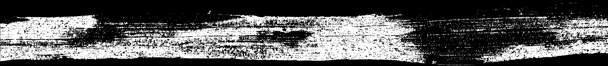
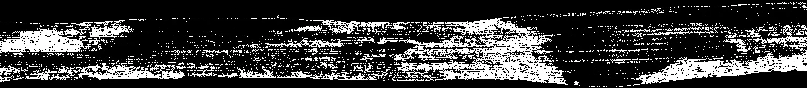
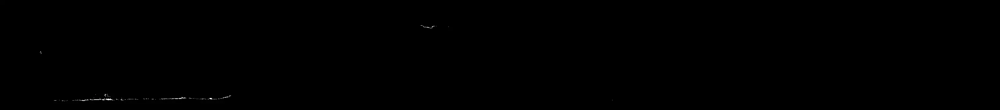
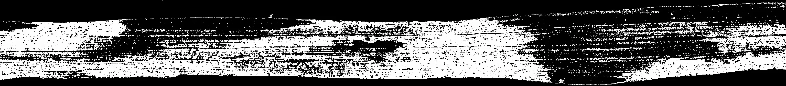
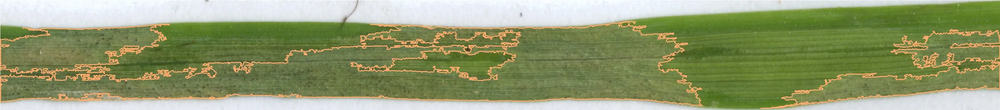

# leaf-disease-recognition

This project aims to study **necrosis** and **pycnidia** on a leaf. It is led by a PHD student in **biology**. My goal is to help him in the processing of his images.
Following this analysis, we generate a dataset. This dataset will also be the subject of an in-depth study. This project is therefore the first step of his **thesis**.

Definitions : 
* Necrosis : Death of tissue through injury or disease, especially in a localized area. Such an area is usually *brown* or *black*.
* pycnidia : A pycnidia is a type of asexual reproductive structure found in fungi of the order Sphaeropsidales (class Coelomycetes) and lichens whose fungal component belongs to this order. The pycnidia is a spore-like concept of certain imperfect fungi (ascomycetes), usually globose or obpiriform in appearance (in the shape of a bottle or an inverted pear). Inside, very small asexual spores are formed, called conidia or picnospores.

The PHD student sends me the images to be analyzed in TIF form. The dataset will be composed of about **1600 images** each composed of **4 portions** of leaves.

Original image : 


Here is how we proceed our analysis : 
- We determine all the leaves on the image (see `Crop`), which is necessary for our `result.csv` file.
- We analyse all cropped leaves. On each leaf, we detect each `necrosis area`, which are necrotic areas of the leaf. Depending on the leaf, each necrosis may have a different color. To solve this problem, we use different `masks`. (See `Analysis`)
- Then, we detect the pycnidias. The areas calculated previously are very useful, because they allow to **check** if a pycnidia is coherent: if a pycnidia belongs to a `necrotic area` then it is a **true pycnidia**. (See `Analysis`)
- Finally, we create `result.csv` which is composed : 
    * Columns from csv from PHD (columns containing researcher input data)
    * Name,
    * Leaf area in px and cm,
    * Number of necrosis areas,
    * Total area of necrosis areas in px and cm,
    * Number of pycnidia,
    * Total area of pycnidia areas in px and cm.

## Analysis

Function : `get_image_informations(directory, img, file_name, dpi, save)`

Arguments : 
- `directory`: main directory of analysis.
- `img`: TIF file to analyze.
- `dpi`: Number of pixels created on a one-inch area.
- `save`: save all images (cropped and analysed). `True`or `False`. 

### Necrosis treatment

Library used: `OpenCV`.

Different `masks` are used to determine all the necroses on a leaf. 

1. Green necrosis:
2. Green/Gray necrosis
3. Yellow necrosis

Then, the final `mask` is the assembly of these: 

```mask_merged = mask_yellow_necrosis + mask_green_necrosis + mask_gray_necrosis```

Example : 

Original


Green mask



Green/Gray mask



Yellow mask



Final mask



After having assembled all these masks, we apply a threshold of 1000 px minimum to be considered as necrotic area : 



### Pycndias 

Library used: `Scipy`.

Here are the main stages of image analysis : 
1. Convert image to HSV format.
2. Detect leaf contours : 
  * range  : *[0, 35, 65]* to *[255, 255, 255]*.
  *  area > 50000px
4. Detect safe area : 
  * range : *[40, 60, 30]* to *[170, 255, 255]*.
  * area > 1000px
6. Detect necrosis area : 
  * range : *[10, 100, 100]* to *[18, 255, 255]*.
  * area > 300px
8. Detect pycnidias : 
  * range : *[0, 0, 0]* to *[72, 99, 139]*.
  * area < 100px

Optimizations : 
- Hierarchy : The image processing generates a lot of contours. For example, for a single image could generate 4562 *safe zones*, which greatly increases the computational burden. To remedy this, the `findContours()` function returns the contours along with their `hierarchy`.  This function is very useful because we get the `parents` and `children` of each `contour`. So, to take the example of *safe zones*, it is useless to consider a `safe zone` which is already in one of them.
- Area : Many outlines are insignificant in size, so it is useful to remove them. To do this, OpenCV provides `contourArea()`, which returns an area. So we can remove inconsistent areas, for example a `pycnidia` that is too big.
- We obtain the pycnidia with the help of `range` of HSV color. 
However, it happens that some "false pycnidia" are detected in very healthy areas. Indeed, some dark green pixels enter the detection range. At the moment, we use the function `pointPolygonTest()` which checks if a point belongs to a contour. We can therefore remove the *false pycnids* that belong to **very green areas** = *safe zones*.
