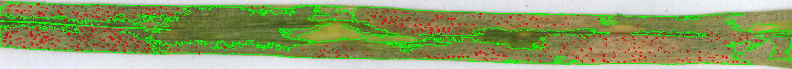
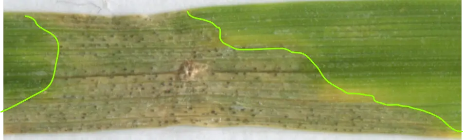
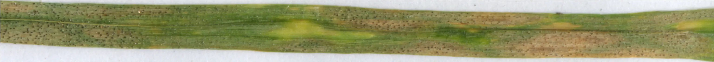

# leaf-disease-recognition

This project aims to study **necrosis** and **pycnidia** on a leaf. It is led by a PHD student in **biology**. My goal is to help her in the processing of her images.
Following this analysis, we generate a dataset. This dataset will also be the subject of an in-depth study. This project is therefore the first step of her **thesis**.



Definitions : 
* **Necrosis** : Death of tissue through injury or disease, especially in a localized area. Such an area is usually *brown* or *black*.



* **Pycnidia** : A pycnidia is a type of **asexual reproductive structure** found in fungi of the order *Sphaeropsidales* (class *Coelomycetes*) and *lichens* whose fungal component belongs to this order. The pycnidia is a spore-like concept of certain imperfect fungi (ascomycetes), usually globose or obpiriform in appearance (in the shape of a bottle or an inverted pear). Inside, very small asexual spores are formed, called *conidia* or *pycnidias*.


The dataset is composed about **1600 images** and each leaf is composed of **4 portions** of leaves.

Original image : 


Here is how we proceed our analysis : 
- We determine all the leaves on the image which is necessary for our *result.csv* file.
- We analyse all cropped leaves. On each leaf, we detect each *necrosis area*, which are necrotic areas of the leaf. Depending on the leaf, each necrosis may have a different color. To solve this problem, we use different `masks`. (See [Analysis](#Analysis))
- Then, we detect the pycnidias. The areas calculated previously are very useful, because they allow to **check** if a pycnidia is coherent: if a pycnidia belongs to a *necrotic area* then it is a **true pycnidia**. (See [Analysis](#Analysis))
- Finally, we create *result.csv* which is composed : 
    * Columns from csv from PHD (columns containing researcher input data)
    * Name,
    * Leaf area in px and cm,
    * Number of necrosis areas,
    * Total area of necrosis areas in px and cm,
    * Number of pycnidia,
    * Total area of pycnidia areas in px and cm.

## Analysis

Function : `get_image_informations(directory, img, file_name, dpi, save)`

Arguments : 
- `directory`: main directory of analysis.
- `img`: TIF file to analyze.
- `dpi`: Number of pixels created on a one-inch area.
- `save`: save all images (cropped and analysed). `True`or `False`. 

### Necrosis treatment

Library used: [OpenCV](https://opencv.org/).

Different `masks` are used to determine all the necroses on a leaf. 

1. Green necrosis
2. Green/Gray necrosis
3. Yellow necrosis

Then, the final `mask` is the assembly of these: 

```mask_merged = mask_yellow_necrosis + mask_green_necrosis + mask_gray_necrosis```

Example : 

Original


Green mask


Green/Gray mask


Yellow mask


Final mask


After having assembled all these masks, we apply these rules :
```py
for necrosis in leaf:
  if necrosis area > 1000px:
      ratio = round(perimeter/area, 3)
      # Removing necroses with a marginal 
      # shape such as 
      # very elongated necroses
      if ratio < 0.25:
        # drawing necrosis
        i+=1
        necrosis_nb += 1
        necrosis_area += area
```


### Pycnidias 

Library used: [SciPy](https://scipy.org/).

One of our problematic is to detect leaf pycnidias which are technically small black dots. However, colors of *small black spores* are differents according to leaf background. We can't solve this just by color. 

The common point between these spors is the **shape**. They can be assimilated to *small circles*.

That's why, we use **convolution kernel**.


Example : 



After detecting the suspected pycnidia, we sort them according to some rules : 
```py
for pycnidias in leaf:
  if pycnidia is in necresis area and pycnidia color belongs to autorized color:
      # drawing pycnidia
      pycnidia_area += area
      pycnidia_number += 1
```

